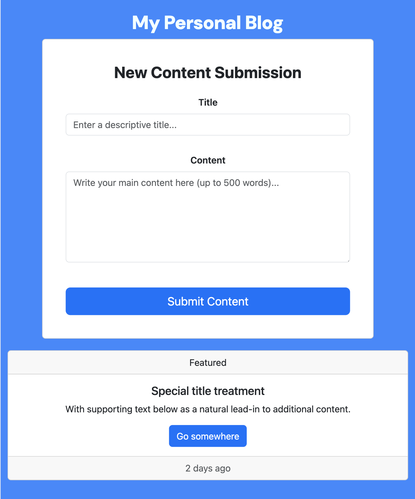

### Interactive Personal Blog Platform
 This APP demonstrates DOM manipulation. To run this project go into personal-blog-sba and then run the index.html file in live server. My thought process was first to work on the form component and then the unordered list where I wanted blog cards to display. I made sure that the form validation was working and if the post was valid pushing that into an array that would display blogs. I utilized bootstraps and google fonts for CSS.

Problems I ran into was taking into account the usage of ID numbers of the elements that were already stored in the local storage.A fix for this was using the date function to store a unique id.I also ran into an issue while trying to editing a post twice. I fixed this by refactoring my event listeners for the button. 

